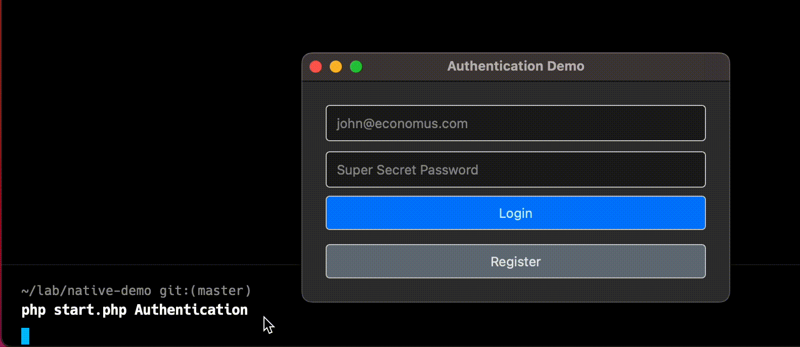
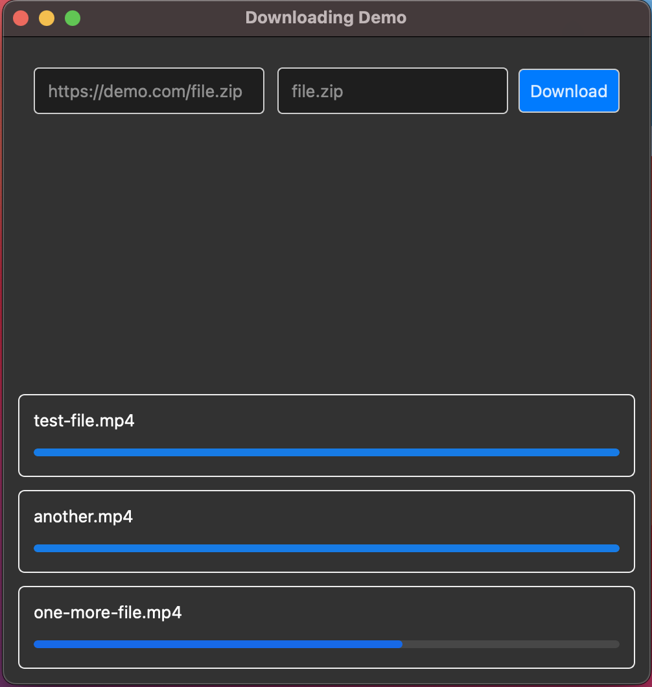

# PHP-QT Demo
If you haven't already, you need to install the [phpqt extension](https://github.com/nazmulpcc/phpqt/).

## Running
At first run `composer install` to install dev dependencies and to create the autoloader. After that you can simply start the project by running `php start.php DemoName` where *DemoName* is a folder in the `examples` directory. Currently, there are two demos, so you can run them by,

```sh
php start.php Authentication
# OR
php start.php Downloader
```

## Screenshots
- Authentication Demo

- Downloader Demo


## Known Issues
The downloader demo cannot handle downloading multiple files at the same time. It crashes with some error that I don't yet understand what those are.